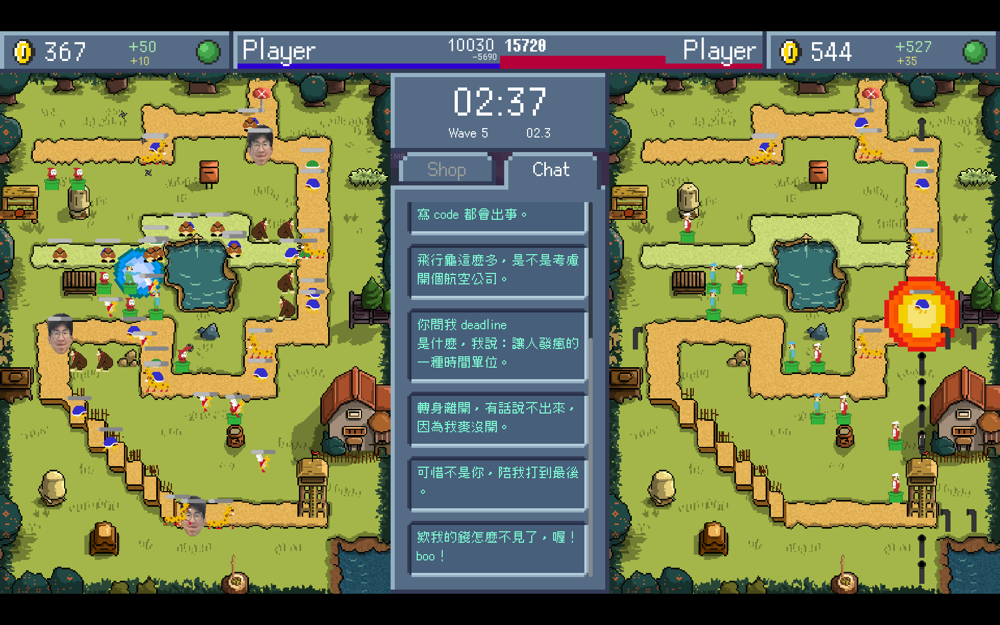

# Challenge2025 - 超解碼農兄弟

超解碼農兄弟（Cringe Coder Bros）是台大資訊系 2025 資訊營使用的教學用遊戲原始碼專案。

整體玩法以雙人對戰塔防為核心，結合塔、敵軍、法術、特殊地圖與外部 agent 介接，作為營隊課程與活動內容的一部分。

請使用[最新版本的遊戲啟動器](https://github.com/CSIE-Challenge/Challenge2025-Launcher/releases/latest)下載並啟動遊戲。

更多資訊請參考：[遊戲 Wiki](https://github.com/CSIE-Challenge/Challenge2025/wiki)

## Credit

### Project Management & Quality Assurance

- 胡祐誠 HyperSoWeak
- 邱翊均 PixelCat

### Game Design & Game Programming

- 卓育安 prairie2022
- 常洧丞 Weber Change
- 廖禹喬 JoyLiao
- 張聲元 LightningFarter
- 李尚哲 Matt
- 林文繡 bbwinner
- 洪德朗 Andromeda
- 王　淇 littlecube8152
- 胡祐誠 HyperSoWeak
- 蔡孟憬 cmj
- 蔡孟衡 lemonilemon
- 蔡瑜恩 Jaime
- 邱翊均 PixelCat

### Art

- 張嘉泰 TDDY
- 張聲元 LightningFarter
- 胡祐誠 HyperSoWeak
- 謝承憲 ChengHsien

### Music & Sound Effect

- 李尚哲 Matt
- 林文繡 bbwinner

### Agent Design & Game Testing

- 張聲元 LightningFarter
- 李尚哲 Matt
- 蔡瑜恩 Jaime
- 高嘉泓 victor0206

### Special Thanks

- Challenge 2024 開發團隊
- 主辦 資工系系學會
- 一起籌備資訊營的人們與參加資訊營的所有人
